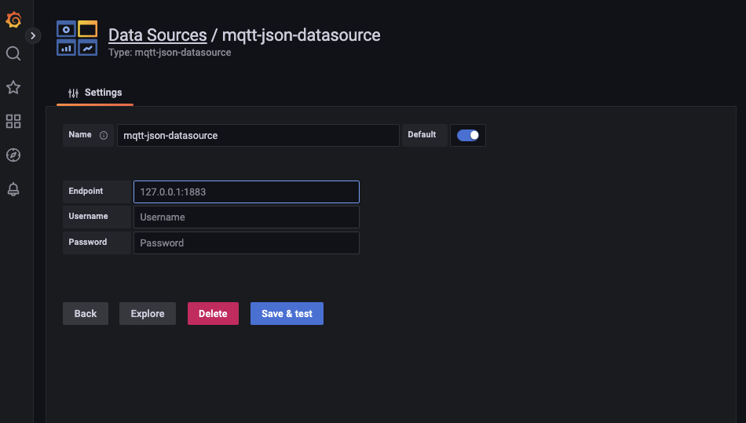
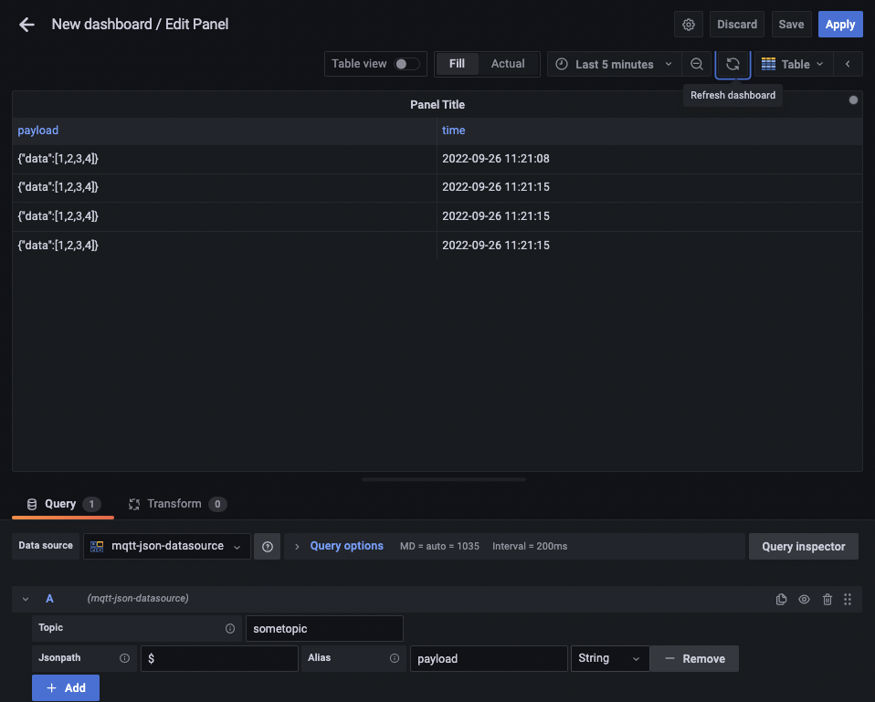
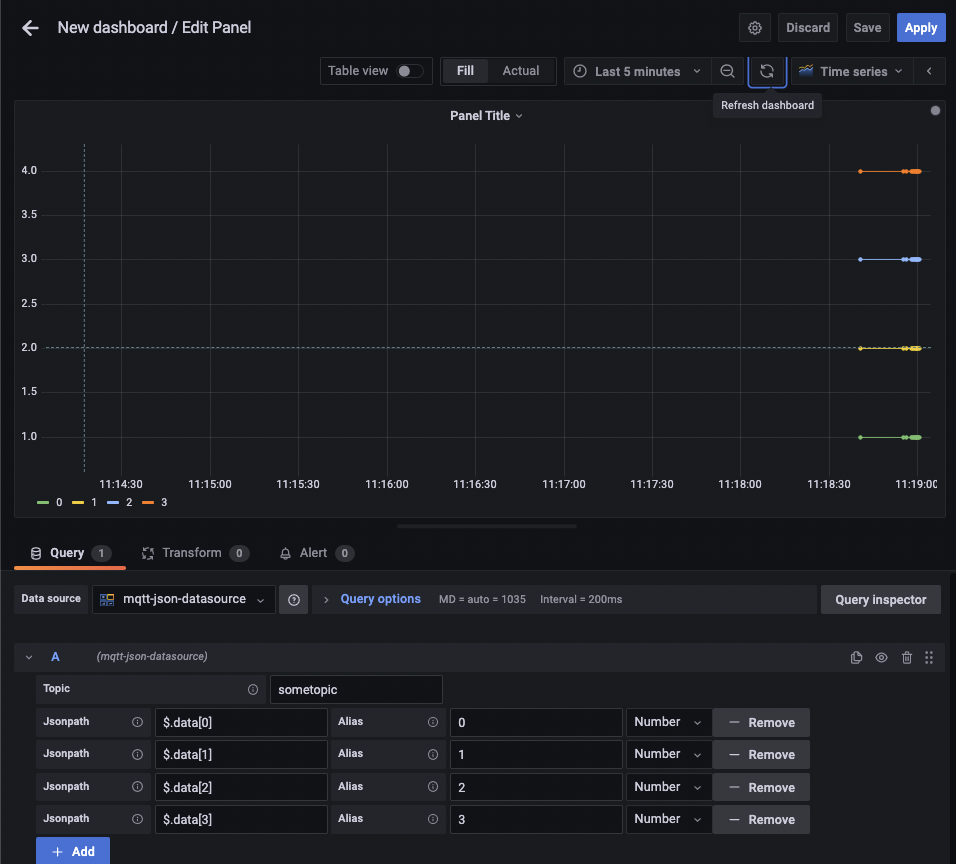

# Grafana's Plugin - MQTTJson

The MQTTJson plugin is a [streaming data source backend plugin](https://grafana.com/tutorials/build-a-streaming-data-source-plugin/).

Used to receive MQTT data and parse it using jsonpath.




## Installation


+ Default plugin directory : /var/lib/grafana/plugins
+ Default grafana.ini : /etc/grafana/grafana.ini

Download [mqtt-jsonpath-datasource.tar.gz
](https://github.com/devoscaryoung/mqtt-json-datasource/releases/download/1.0.0/mqtt-jsonpath-datasource.tar.gz) to your grafana plugin directory and unpack.

try command 
```bash
$ wget 'https://github.com/devoscaryoung/mqtt-json-datasource/releases/download/1.0.0/mqtt-json-datasource.tar.gz'

$ sudo tar zxvf mqtt-jsonpath-datasource.tar.gz -C /var/lib/grafana/plugins
```

Setting `grafana.ini` to allow unsign plugin.

```bash
$ sudo nano /etc/grafana/.

[plugins]
;enable_alpha = false
;app_tls_skip_verify_insecure = false
# Enter a comma-separated list of plugin identifiers to identify plugins to load even if they are unsigned. Plugins with modified signatures are never loaded.
allow_loading_unsigned_plugins = devoscaryoung-mqtt-json-datasource;
...
```

If using container to run grafana, can use this command to get container bash shell.

```bash
$ docker exec -it -u root grafana bash
```

You can install some editor with `apk`

```bash
$ apk add nano
```

## Reference

https://github.com/grafana/mqtt-datasource

https://github.com/marcusolsson/grafana-json-datasource